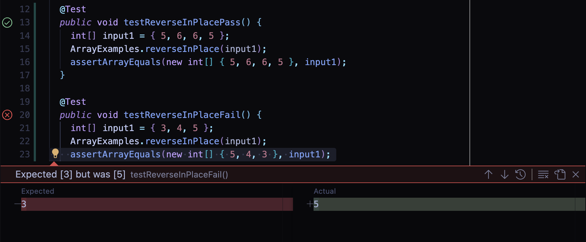

# Lab Report 3: Feb 13, 2024

* [Part 1: Bugs](#part-1)
* [Part 2: Researching Commands](#part-2)

## Part 1: Bugs <a name="part-1"></a>

* A failure-inducing input for the buggy program  
  ```java
  @Test
    public void testReverseInPlaceFail() {
      int[] input1 = { 3, 4, 5 };
      ArrayExamples.reverseInPlace(input1);
      assertArrayEquals(new int[] { 5, 4, 3 }, input1);
    }
  ```

* An input that doesn't induce a failure, as a JUnit test and any associated code  
  ```java
  @Test
    public void testReverseInPlacePass() {
      int[] input1 = { 5, 6, 6, 5 };
      ArrayExamples.reverseInPlace(input1);
      assertArrayEquals(new int[] { 5, 6, 6, 5 }, input1);
    }
  ```

* The symptom, as the output of running the tests  
  

* The bug, as the before-and-after code change required to fix it

  * Before:

    ```java
    static void reverseInPlace(int[] arr) {
      for(int i = 0; i < arr.length; i += 1) {
        arr[i] = arr[arr.length - i - 1];
      }
    }
    ```

  * After: 

    ```java
    static void reverseInPlace(int[] arr) {
      for (int i = 0; i < arr.length / 2; i += 1) {
        int temp = arr[i];
        arr[i] = arr[arr.length - i - 1];
        arr[arr.length - i - 1] = temp;
      }
    }
    ```
    
  Using a temporary variable prevents the previous value of `arr[i]` from being lost after `arr[i]` is reassigned to `arr[arr.length - i - 1]`.
  Additionally, `i < arr.length` is changed to `i < arr.length / 2` so that the pairs of elements being swapped are only swapped once instead of twice.


## Part 2: Researching Commands <a name="part-2"></a>

I am researching the command `find`. I found this [link from redhat.com](https://www.redhat.com/sysadmin/linux-find-command) that describes some different options. I used `man find` to look up more details.

1. `-name` allows you to find files by name
  * This code finds the location of a file named `chapter-1.txt`, which is useful if you know a file name but don't know or don't remember where it is stored. 
    ```
    $ find technical -name "chapter-1.txt"
    technical/911report/chapter-1.txt
    ```
  * This code finds the location of all files with names matching the pattern `Session*-PDF.txt`. This is useful for finding multiple files with a similar name, or if you want to find a file and don't remember the exact name.
    ```
    $ find technical -name "Session*-PDF.txt"
    technical/government/Alcohol_Problems/Session2-PDF.txt
    technical/government/Alcohol_Problems/Session3-PDF.txt
    technical/government/Alcohol_Problems/Session4-PDF.txt
    ```
2. `-ls` lists all files and directories along with information about each one. 
  * This code lists all files and directories in the `government` directory and associated info. It is useful for seeing file size, file permissions, owner, etc. 
    ```
    $ find technical/government -ls
    17460172        0 drwxr-xr-x    8 sophiazhu        staff                 256 Feb  8 14:16 technical/government
    17460173        0 drwxr-xr-x   19 sophiazhu        staff                 608 Feb  8 14:16 technical/government/About_LSC
    17460178       16 -rwxr-xr-x    1 sophiazhu        staff                7083 Feb  8 14:16 technical/government/About_LSC/LegalServCorp_v_VelazquezSyllabus.txt
    17460181       96 -rwxr-xr-x    1 sophiazhu        staff               47991 Feb  8 14:16 technical/government/About_LSC/Progress_report.txt
    ...
    ```
  * Example 2
3. `-type`
  * Example 1
  * Example 2
4. sdfsdfds
  * Example 1
  * Example 2
