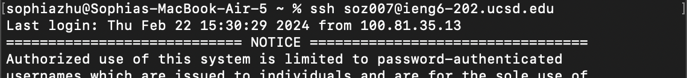

# Lab Report 4: Feb 27, 2024

## Step 4

Keys pressed: `ssh <space> soz007@ieng6-202.ucsd.edu <enter>`

I used the command `ssh soz007@ieng6-202.ucsd.edu` to log into `ieng6`, specifically the `ieng6-202` host. 
I had cleared my terminal history before this so I typed the whole command. 

## Step 5

Keys pressed: `git clone <Command+V> <enter>`

Prior to this step, I copid the SSH URL from my fork on GitHub so I could easily paste it in Terminal. 
I used the command `git clone git@github.com:syz16/lab7.git` to clone my fork into the `lab7` repository on `ieng6`. 

## Step 6

Keys pressed: `cd lab <tab> <enter> bash t <tab> <enter>`

I used the commands `cd lab7` and `bash test.sh` to first change into the directory I just cloned, and then to run the tests. 
I used the tab key to autocomplete `lab7` and `test.sh`. 

## Step 7

Keys pressed: `vim List <tab> .j <tab> <enter> 43j e x i 2 <esc> :wq <enter>`

I first used the command `vim ListExamples.java` to start editing `ListExamples.java`, since that is where the bug is located. I used tabs to autocomplete the command. 
Then, inside the Vim editor, I typed `43j` to go down to row 44 where the bug is. 
I typed `e` to go to the end of the first word and `x` to delete the incorrect character. 
Then I typed`i 2 <esc>` to enter insert mode, type the correct character, and go back to normal mode. 
Finally I typed `:wq <enter>` to save the changes and exit vim. 

## Step 8

Keys pressed: `<up> <up> <enter>`

I ran the tests again using `bash test.sh`. This is the same command from step 6, which was 2 commands ago, so I just need to use the up arrow twice. 

## Step 9

Keys pressed: `git add . <enter> git commit -m "edit ListExamples.java" <enter> git push <enter>`

I staged all the changed files (which was just `ListExamples.java`) using `git add .`. 
Then I commited those files and added a commit message using `git commit -m "edit ListExamples.java`.
Finally I pushed my changes to GitHub using `git push`.
